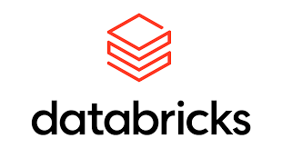

# Actividad de Reconocimiento del Entorno: Databricks

## Paso 1. Ingreso y reconocimiento del entorno
Databricks es una plataforma de análisis de datos en la nube que proporciona un entorno colaborativo para el procesamiento y análisis de grandes volúmenes de datos. Fue fundada por los creadores de Apache Spark, un motor de procesamiento de datos en memoria, y se ha convertido en una herramienta popular para la ingeniería de datos, la ciencia de datos y el aprendizaje automático.

## Paso 2. Creación de un notebook de trabajo
**Repositorio:** [Insertar link aquí]

## Paso 3. Carga del conjunto de datos
1. Iniciar sesión en **Databricks** y acceder al espacio de trabajo.
2. Navegar al menú lateral y seleccionar **"Data"** (Datos).
3. Hacer clic en **"Create"** (Crear) y seleccionar **"Table"** (Tabla).
4. Elegir la opción **"Upload File"** (Cargar archivo) para cargar un archivo desde el ordenador local.
5. Si seleccionas **"Upload File"**, elige el archivo que deseas cargar y sigue las instrucciones para completar el proceso de carga.
6. Después de cargar los datos, la tabla estará disponible en el catálogo de Databricks y podrás consultarla y analizarla utilizando SQL o PySpark en tus cuadernos de Databricks.
7. Si quieres un espacio más personalizado para la carga puedes generar el catálogo, el esquema y por último sobre el esquema generas la tabla.

## Paso 4. Exploración inicial de los datos
Visualización de las primeras filas del dataset, su estructura general. Identificación de nombres de columnas, tipos de datos, posibles valores nulos y volumen aproximado de registros.
La información de la tabla es estructurada con esquema y tipos de datos definidos.

## Paso 5. Almacenamiento en formato tabular
Al convertir un dataset como una tabla **Delta**, se facilita la integración con herramientas de análisis y visualización de datos. Las tablas Delta pueden ser consultadas utilizando SQL, lo que permite a los analistas y científicos de datos trabajar con los datos de manera más intuitiva.

## Paso 6. Consulta básica de datos
Ejecuta consultas básicas sobre la tabla creada. Como mínimo, debes realizar:
* Una consulta para contar el número total de registros.
* Una consulta para seleccionar columnas relevantes.
* Una consulta con filtro.
* Una consulta agregada simple (ej. promedio, suma o conteo por categoría).

## Paso 7. Visualización inicial
Visualización de datos de la consulta.

## Paso 8. Análisis de la experiencia de uso
Redacta una reflexión técnica breve sobre la experiencia desarrollada.

### ¿Qué ventajas observas al trabajar en una plataforma unificada como Databricks?
Al trabajar con Databricks puedes trabajar con bases de datos y hacer llamados a la información sin conexiones externas, lo que hace que el proceso de análisis de datos sea más fluido y eficiente. Además, Databricks ofrece una amplia gama de herramientas integradas para la manipulación y visualización de datos, lo que facilita la colaboración entre equipos y mejora la productividad en proyectos de Big Data. La capacidad de escalar recursos según sea necesario también es una ventaja importante, ya que permite manejar grandes volúmenes de datos sin preocuparse por la infraestructura subyacente.

### ¿Qué dificultades encontraste en la carga, organización o consulta de los datos?
La plataforma es intuitiva en la generación y carga de bases de datos con conocimientos básicos.

### ¿Qué papel cumplen el almacenamiento estructurado y el procesamiento distribuido en un contexto de datos masivos?
Son claves en contexto de datos masivos debido a las siguientes razones:
* **El almacenamiento estructurado:** apoya desde su estructura tabular, lo que facilita la gestión, consulta y análisis de datos, con la aplicación de esquemas y reglas que garanticen la integridad y consistencia de datos.
* **El procesamiento distribuido:** apoya con su capacidad de dividir y distribuir tareas permitiendo la administración de volúmenes de datos de manera eficiente y rápida.

### ¿Cómo se relaciona esta experiencia con escenarios reales de analítica de datos?
El uso de bases de datos estructuradas, el reconocimiento de los datos y tipos de datos, el uso de consultas, la aplicación de herramientas como Python y librerías para el tratamiento y visualización de la data permite un acercamiento a escenarios reales de analítica de datos.
