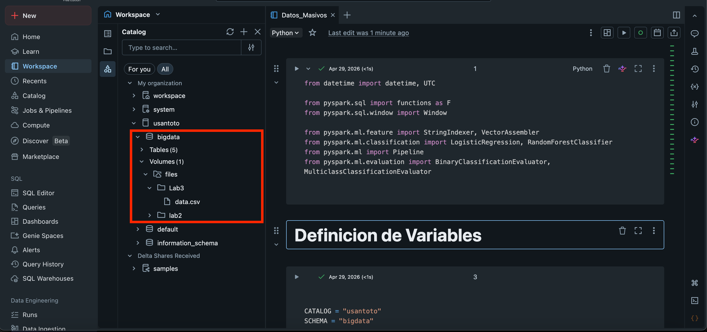
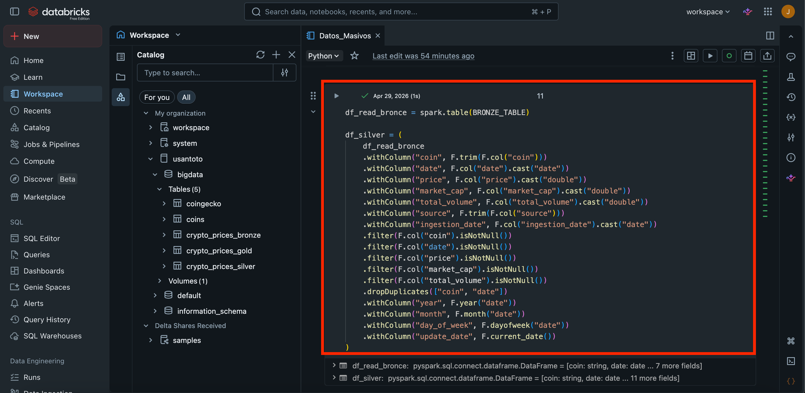
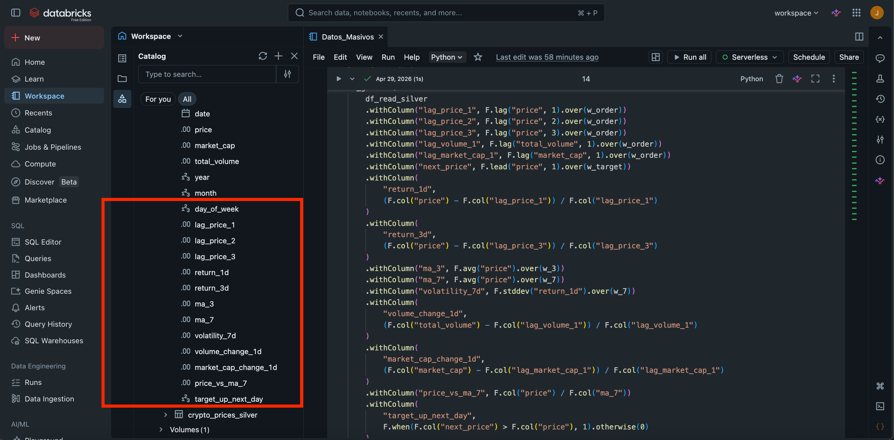
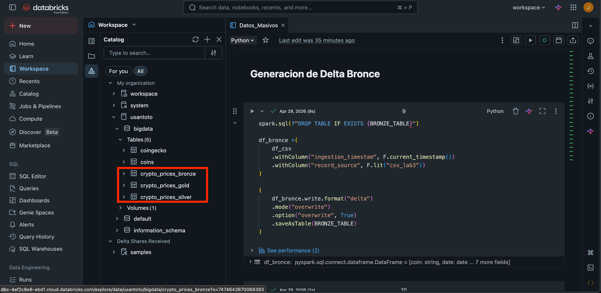
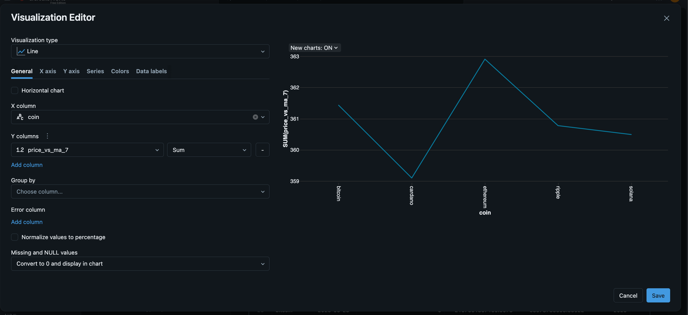
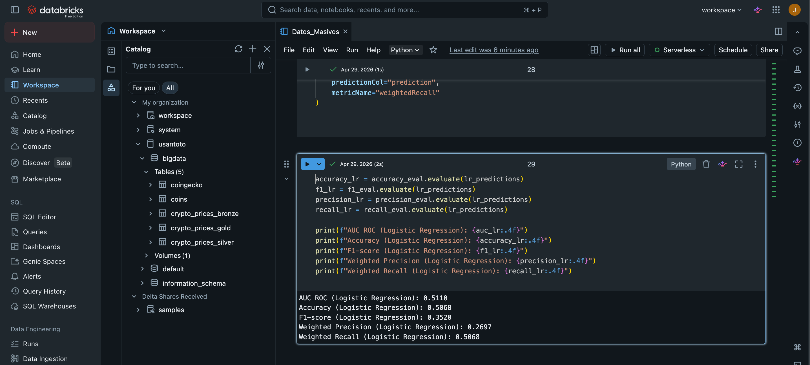

# Actividad procesamiento masivo


## Ingreso y reconocimiento del entorno
Databricks es una plataforma de análisis de datos en la nube que proporciona un entorno colaborativo para el procesamiento y análisis de grandes volúmenes de datos. Fue fundada por los creadores de Apache Spark, un motor de procesamiento de datos en memoria, y se ha convertido en una herramienta popular para la ingeniería de datos, la ciencia de datos y el aprendizaje automático.


## Arquitectura Lakehouse 
    la arquitectura Lakehouse combina lo mejor de los data lakes y los data warehouses, proporcionando una plataforma unificada para el almacenamiento y análisis de datos. En esta arquitectura, los datos se almacenan en un formato abierto y escalable, lo que permite a las organizaciones aprovechar la flexibilidad de los data lakes mientras mantienen la estructura y el rendimiento de los data warehouses. Las capas típicas en una arquitectura Lakehouse incluyen:`

### Capa bronce
    En esta capa se almacenan los datos en su forma más cruda, sin procesar ni transformar. Los datos pueden provenir de diversas fuentes, como bases de datos, archivos, flujos de datos en tiempo real, etc. La capa bronce actúa como un repositorio de datos sin formato que puede ser utilizado para análisis exploratorios o para realizar transformaciones posteriores.


### Capa silver 
    En esta capa se realizan transformaciones y limpiezas de los datos almacenados en la capa bronce. Aquí se aplican reglas de calidad de datos, se eliminan duplicados, se corrigen errores y se estructuran los datos para facilitar su análisis. La capa silver proporciona una versión más limpia y organizada de los datos que puede ser utilizada para análisis más avanzados.

### Capa gold
    En esta capa se almacenan los datos que han sido completamente transformados y optimizados para su análisis. Aquí se aplican técnicas de modelado de datos, se crean agregaciones y se optimizan las consultas para mejorar el rendimiento. La capa gold es la capa final que se utiliza para análisiss y visualización de datos, y es donde se encuentran los datos listos para ser consumidos por los usuarios finales o por aplicaciones de análisis de datos.


**Repositorio:** [https://github.com/JuSeUlloa/BigDataMCienciaDatos/blob/main/actividad_reconocimiento/Actividad_Procesamiento_Masivo.md]

## Paso 1. Recupera los datos generados en el laboratorio anterior o utiliza el dataset base suministrado por el docente.




## Paso 2. Construye una arquitectura de procesamiento por capas dentro del enfoque lakehouse:

### Definicion de Variables 

``` python

CATALOG = "usantoto"
SCHEMA = "bigdata"
FILE ='data.csv'
PATH = '/Volumes/usantoto/bigdata/files/Lab3/'
 
BRONZE_TABLE = f"{CATALOG}.{SCHEMA}.crypto_prices_bronze"
SILVER_TABLE = f"{CATALOG}.{SCHEMA}.crypto_prices_silver"
GOLD_TABLE = f"{CATALOG}.{SCHEMA}.crypto_prices_gold"

RUN_TS = datetime.now(UTC)
RUN_DATE = RUN_TS.strftime("%Y-%m-%d")

```
## Paso 3. Almacena cada capa del flujo como tabla Delta en Databricks:
Desarrolla transformaciones con Spark que permitan:
-	Validar tipos de datos y corregir inconsistencias.
-	Eliminar registros nulos o duplicados.
-	Estandarizar campos de fecha, moneda y precio.
-	Generar métricas agregadas por moneda y por fecha.



-	Construir variables derivadas como: 
*	variación porcentual diaria,
*	media móvil,
*	volatilidad simple,
*	precio rezagado,



## Paso 4. Almacena cada capa del flujo como tabla Delta en Databricks:
-	Guarda la capa Bronze como representación inicial.
-	Guarda la capa Silver como versión depurada y estructurada.
-	Guarda la capa Gold como tabla analítica lista para consulta y modelado.

### Capa bronce: Almacenamiento de datos crudos
```python
spark.sql(f"DROP TABLE IF EXISTS {BRONZE_TABLE}")

df_bronce =(
    df_csv
    .withColumn("ingestion_timestam", F.current_timestamp())
    .withColumn("record_source", F.lit("csv_lab3"))
)

(
    df_bronce.write.format("delta")
    .mode("overwrite")
    .option("overwrite", True)
    .saveAsTable(BRONZE_TABLE)
)

df_csv =(
  spark.read.option("header", True)
  .option("inferSchema",True)
  .csv(f"{PATH}{FILE}")
)

```
### Capa silver: Transformación y limpieza de datos
``` python
df_read_bronce = spark.table(BRONZE_TABLE)

df_silver = (
    df_read_bronce
    .withColumn("coin", F.trim(F.col("coin")))
    .withColumn("date", F.col("date").cast("date"))
    .withColumn("price", F.col("price").cast("double"))
    .withColumn("market_cap", F.col("market_cap").cast("double"))
    .withColumn("total_volume", F.col("total_volume").cast("double"))
    .withColumn("source", F.trim(F.col("source")))
    .withColumn("ingestion_date", F.col("ingestion_date").cast("date"))
    .filter(F.col("coin").isNotNull())
    .filter(F.col("date").isNotNull())
    .filter(F.col("price").isNotNull())
    .filter(F.col("market_cap").isNotNull())
    .filter(F.col("total_volume").isNotNull())
    .dropDuplicates(["coin", "date"])
    .withColumn("year", F.year("date"))
    .withColumn("month", F.month("date"))
    .withColumn("day_of_week", F.dayofweek("date"))
    .withColumn("update_date", F.current_date())
)

spark.sql(f"DROP TABLE IF EXISTS {SILVER_TABLE}")

(
    df_silver.write.format("delta")
    .mode("overwrite")
    .saveAsTable(SILVER_TABLE)
)
```
### Capa gold: Optimización y modelado de datos para análisis
```python
df_read_silver = spark.table(SILVER_TABLE)
 
w_order = Window.partitionBy("coin").orderBy("date")
print(w_order)
w_3 = Window.partitionBy("coin").orderBy("date").rowsBetween(-2, 0)
print(w_3)
w_7 = Window.partitionBy("coin").orderBy("date").rowsBetween(-6, 0)
print(w_7)
w_target = Window.partitionBy("coin").orderBy("date")
print(w_target)

df_gold = (
    df_read_silver
    .withColumn("lag_price_1", F.lag("price", 1).over(w_order))
    .withColumn("lag_price_2", F.lag("price", 2).over(w_order))
    .withColumn("lag_price_3", F.lag("price", 3).over(w_order))
    .withColumn("lag_volume_1", F.lag("total_volume", 1).over(w_order))
    .withColumn("lag_market_cap_1", F.lag("market_cap", 1).over(w_order))
    .withColumn("next_price", F.lead("price", 1).over(w_target))
    .withColumn(
        "return_1d",
        (F.col("price") - F.col("lag_price_1")) / F.col("lag_price_1")
    )
    .withColumn(
        "return_3d",
        (F.col("price") - F.col("lag_price_3")) / F.col("lag_price_3")
    )
    .withColumn("ma_3", F.avg("price").over(w_3))
    .withColumn("ma_7", F.avg("price").over(w_7))
    .withColumn("volatility_7d", F.stddev("return_1d").over(w_7))
    .withColumn(
        "volume_change_1d",
        (F.col("total_volume") - F.col("lag_volume_1")) / F.col("lag_volume_1")
    )
    .withColumn(
        "market_cap_change_1d",
        (F.col("market_cap") - F.col("lag_market_cap_1")) / F.col("lag_market_cap_1")
    )
    .withColumn("price_vs_ma_7", F.col("price") / F.col("ma_7"))
    .withColumn(
        "target_up_next_day",
        F.when(F.col("next_price") > F.col("price"), 1).otherwise(0)
    )
)

```



## Paso 5. Explora analíticamente la capa Gold y genera evidencia del procesamiento
-	Consulta precios promedio por moneda.
``` python
display(
    spark.sql(f"""
    SELECT
        coin,
        ROUND(AVG(price), 2) AS avg_price,
        ROUND(AVG(volatility_7d), 6) AS avg_volatility_7d
    FROM {GOLD_TABLE}
    GROUP BY coin
    ORDER BY avg_price DESC
    """)
)
```
-	Calcula variaciones en el tiempo.
``` python
display(
    spark.sql(f"""
    SELECT
        coin,
        date,
        price,
        ma_7,
        return_1d
    FROM {GOLD_TABLE}
    WHERE coin = 'bitcoin'
    ORDER BY date
    """)
)
```
-	Identifica monedas con mayor volatilidad.
``` python
display(
    spark.sql(f"""
    SELECT
        coin,
        target_up_next_day,
        COUNT(*) AS total_rows
    FROM {GOLD_TABLE}
    GROUP BY coin, target_up_next_day
    ORDER BY coin, target_up_next_day
    """)
)
```
-	Visualiza al menos una tendencia temporal y una comparación entre monedas.




## Paso 6. Construye un modelo básico de machine learning con Spark MLlib:
-	Define una variable objetivo apropiada, por ejemplo: 
-	predecir el precio siguiente,
	o clasificar si el precio subirá o bajará en el siguiente periodo.
-	Selecciona variables predictoras derivadas de la capa Gold.
``` python
df_ml = spark.table(GOLD_TABLE)
 
feature_cols§ = [
    "market_cap",
    "total_volume",
    "year",
    "month",
    "day_of_week",
    "lag_price_1",
    "lag_price_2",
    "lag_price_3",
    "return_1d",
    "return_3d",
    "ma_3",
    "ma_7",
    "volatility_7d",
    "volume_change_1d",
    "market_cap_change_1d",
    "price_vs_ma_7"
]
 
df_ml = df_ml.select("coin", "date", "target_up_next_day", *feature_cols)
display(df_ml.orderBy("coin", "date"))
```

-	Divide el dataset en entrenamiento y prueba.
``` python
distinct_dates = (
    df_ml.select("date")
    .distinct()
    .orderBy("date")
    .toPandas()["date"]
    .tolist()
)
 
split_idx = int(len(distinct_dates) * 0.8)
split_date = distinct_dates[split_idx]
 
print("Split date:", split_date)

train_df = df_ml.filter(F.col("date") < F.lit(split_date))
test_df = df_ml.filter(F.col("date") >= F.lit(split_date))
 
print("Train rows:", train_df.count())
print("Test rows:", test_df.count())
``` 

-	Entrena un modelo básico usando Spark MLlib.
``` python
lr_model = lr_pipeline.fit(train_df)
lr_predictions = lr_model.transform(test_df)
 
display(
    lr_predictions.select(
        "coin",
        "date",
        "target_up_next_day",
        "prediction",
        "probability"
    ).orderBy("coin", "date")
)
```
-	Evalúa el desempeño del modelo mediante métricas adecuadas al tipo de problema.
``` python
binary_eval = BinaryClassificationEvaluator(
    labelCol="target_up_next_day",
    rawPredictionCol="rawPrediction",
    metricName="areaUnderROC"
)
 
auc_lr = binary_eval.evaluate(lr_predictions)
 
accuracy_eval = MulticlassClassificationEvaluator(
    labelCol="target_up_next_day",
    predictionCol="prediction",
    metricName="accuracy"
)
 
f1_eval = MulticlassClassificationEvaluator(
    labelCol="target_up_next_day",
    predictionCol="prediction",
    metricName="f1"
)
 
precision_eval = MulticlassClassificationEvaluator(
    labelCol="target_up_next_day",
    predictionCol="prediction",
    metricName="weightedPrecision"
)
 
recall_eval = MulticlassClassificationEvaluator(
    labelCol="target_up_next_day",
    predictionCol="prediction",
    metricName="weightedRecall"
)

accuracy_lr = accuracy_eval.evaluate(lr_predictions)
f1_lr = f1_eval.evaluate(lr_predictions)
precision_lr = precision_eval.evaluate(lr_predictions)
recall_lr = recall_eval.evaluate(lr_predictions)
 
print(f"AUC ROC (Logistic Regression): {auc_lr:.4f}")
print(f"Accuracy (Logistic Regression): {accuracy_lr:.4f}")
print(f"F1-score (Logistic Regression): {f1_lr:.4f}")
print(f"Weighted Precision (Logistic Regression): {precision_lr:.4f}")
print(f"Weighted Recall (Logistic Regression): {recall_lr:.4f}")

``` 


## 7. Analiza los resultados del modelo y del flujo de procesamiento:
-	Describe qué variables fueron utilizadas:
    
    market_cap, ( capitalización de mercado )
    total_volume, ( volumen total )
    year, (año )
    month, (mes )
    day_of_week ( día de la semana ),
    lag_price_1 ( precio rezagado 1 día ),
    lag_price_2 ( precio rezagado 2 días ),
    lag_price_3 ( precio rezagado 3 días ),
    return_1d ( retorno 1 día ),
    return_3d ( retorno 3 días ),
    ma_3 ( media móvil 3 días ),
    ma_7 ( media móvil 7 días ),
    volatility_7d ( volatilidad 7 días ),
    volume_change_1d ( cambio en volumen 1 día ),
    market_cap_change_1d ( cambio en capitalización 1 día ),
    price_vs_ma_7 ( precio vs media móvil 7 días )

-	Explica qué transformaciones resultaron más relevantes.
    
    procesamiento de datos, generación de variables derivadas, manejo de valores nulos y duplicados, estandarización de formatos, etc.

- Interpreta el desempeño obtenido por el modelo.

    Accuracy (Logistic Regression): 0.5068 es el valor obtenido por el modelo de regresión logística, lo que indica que el modelo tiene una precisión del 50.68% al clasificar correctamente los casos positivos y negativos.
    F1-score (Logistic Regression): 0.3520  sugiere que el modelo tiene un rendimiento moderado en términos de clasificación de un 35.20%.
    Weighted Precision (Logistic Regression): 0.2697 indica que el modelo tiene una precisión ponderada del 26.97% al clasificar correctamente los casos positivos y negativos, teniendo en cuenta el desequilibrio de clases.
    
Weighted Recall (Logistic Regression): 0.5068 indica que el modelo tiene una capacidad de recuperación ponderada del 50.68% al identificar correctamente los casos positivos y negativos, teniendo en cuenta el desequilibrio de clases.

-	Relaciona la calidad del modelo con la calidad de los datos procesados.

    la calidad de los datos no es proporcional a la calidad del modelo, ya que el modelo puede tener un desempeño limitado debido a la complejidad del problema, la cantidad de datos disponibles, la selección de variables, entre otros factores. Sin embargo, es importante destacar que una buena calidad de los datos procesados puede contribuir a mejorar el desempeño del modelo al proporcionar información más precisa y relevante para el aprendizaje automático.


## 8. Reflexiona sobre las decisiones tomadas durante la construcción del flujo lakehouse:

- ¿Qué valor aporta separar los datos en capas Bronze, Silver y Gold?

Ofrece una estructura clara para el procesamiento de datos, permitiendo una gestión eficiente de los datos en diferentes etapas de limpieza y transformación. La capa Bronze almacena los datos en diferentes formatos data semiestructurados, la capa Silver contiene datos limpios y estructurados, por ultimo la capa Gold está optimizada para análisis y modelado. Esta separación facilita la trazabilidad, la reutilización de datos y la colaboración entre equipos.

- ¿Qué diferencias existen entre almacenar datos crudos y almacenar datos refinados?

Alamacenar datos crudos implica guardar los datos en su forma original, sin  ningún tipo de limpieza, transformación o estructuración. Esto puede incluir  errores, valores nulos, formatos inconsistentes y duplicados dentro de la data.
Por otro lado, almacenar datos refinados implica que los datos fueron procesados para corregir errores, eliminar duplicados, manejar valores nulos y estandarizar los datos. 

- ¿Qué ventajas ofrece Delta Lake para el procesamiento incremental y la trazabilidad?

 Dentro de  las ventajas de Delta Lake, se encuentra la capacidad de realizar actualizaciones y eliminaciones en los datos de manera eficiente, lo que facilita el manejo de cambios en los datos a lo largo del tiempo.  Delta Lake contiene un historial completo de las versiones de los datos, lo que permite rastrear y auditar los cambios realizados en los datos, aportando en la transparencia y la confiabilidad de los procesos de análisis.

•	¿Cómo impacta la calidad del procesamiento en el desempeño de un modelo predictivo?

La calidad del procesamiento de datos cumple un rol directo en el desempeño de un modelo predictivo. Un procesamiento de datos deficiente, que incluye errores o informacion vacia , duplicados o formatos inconsistentes, puede introducir ruido y sesgo en los datos, lo que a su vez puede afectar negativamente la capacidad del modelo para aprender patrones significativos y generalizar a nuevos datos. 

Por otro lado, un procesamiento de datos de alta calidad, que contiene fases de limpieza, transformación y estructuración adecuadas, puede mejorar la calidad de los datos de entrada al modelo, lo que puede resultar en un mejor desempeño del modelo en términos de precisión, recall, F1-score y otras métricas relevantes.

•	¿Qué limitaciones observaste al trabajar este flujo en un entorno controlado como Databricks Free Edition?

las principales limitantes de usar el entorno free de databricks se visualizan en términos de recursos computacionales, ( Memoria y  procesamiento).Esto puede afectar la activida de procesamiento de datos y el entrenamiento de modelos, en especial cuando se trabaja con volumenes de informacion altos o modelos con niveles de  complejidad. Además, la edición gratuita puede tener restricciones en cuanto al tiempo de ejecución y la cantidad de almacenamiento disponible, por ultimo en algunos casos al trabajar con archivos .py que se conectan con la infromacion de las tablas, se pueden presentar errores de conexión o de lectura de datos, lo que puede dificultar el desarrollo y la ejecución del flujo de procesamiento.


