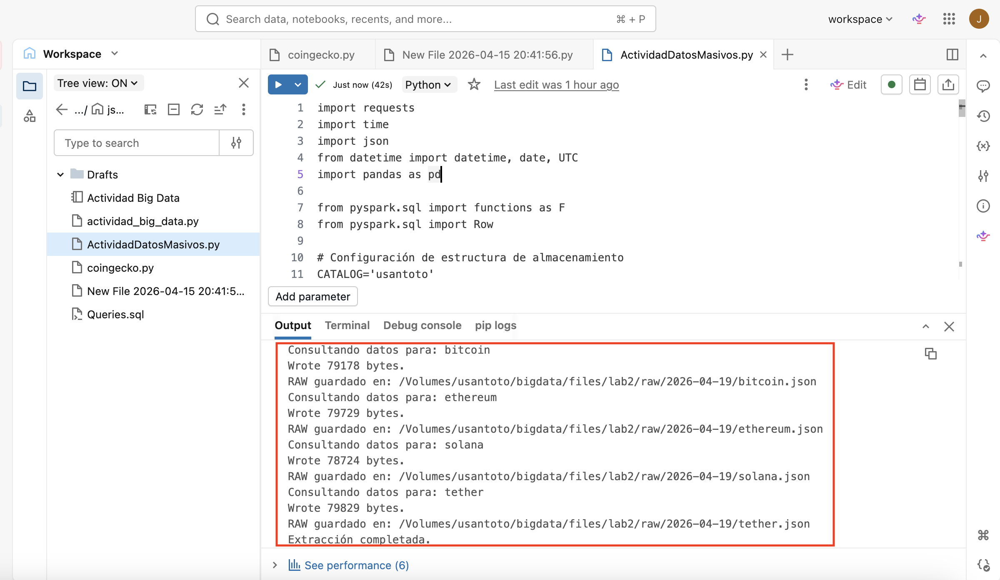
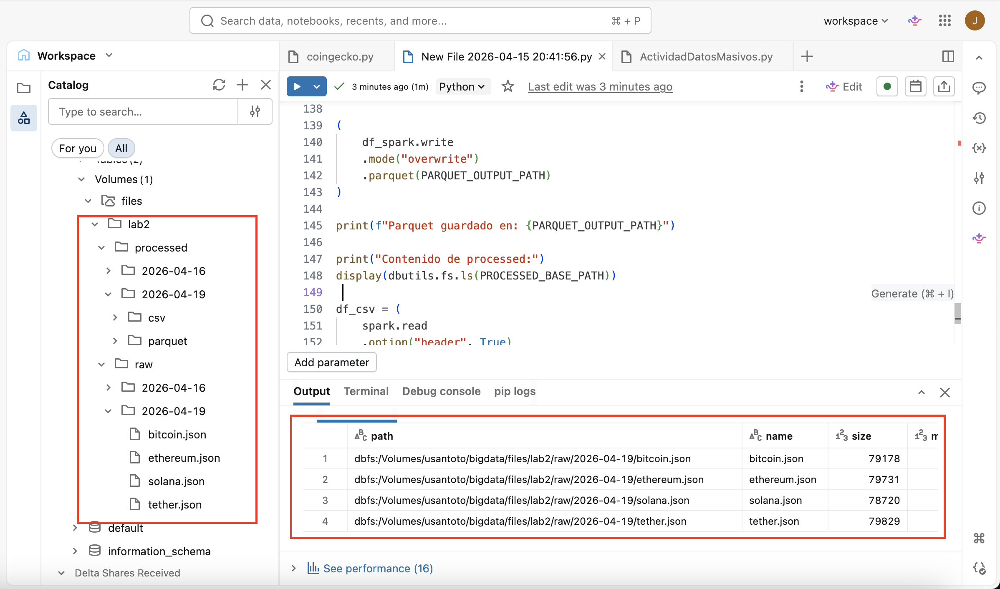
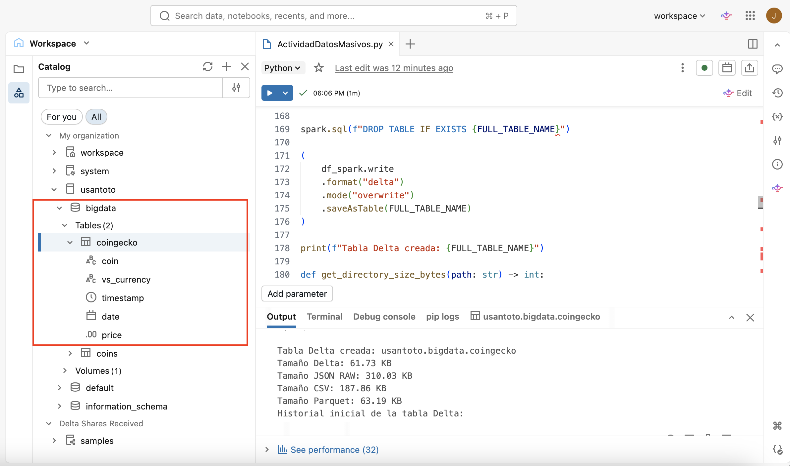
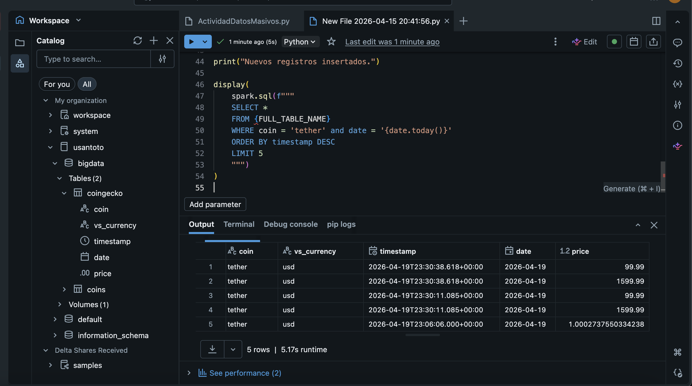
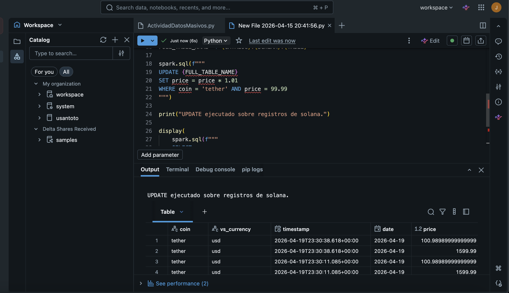
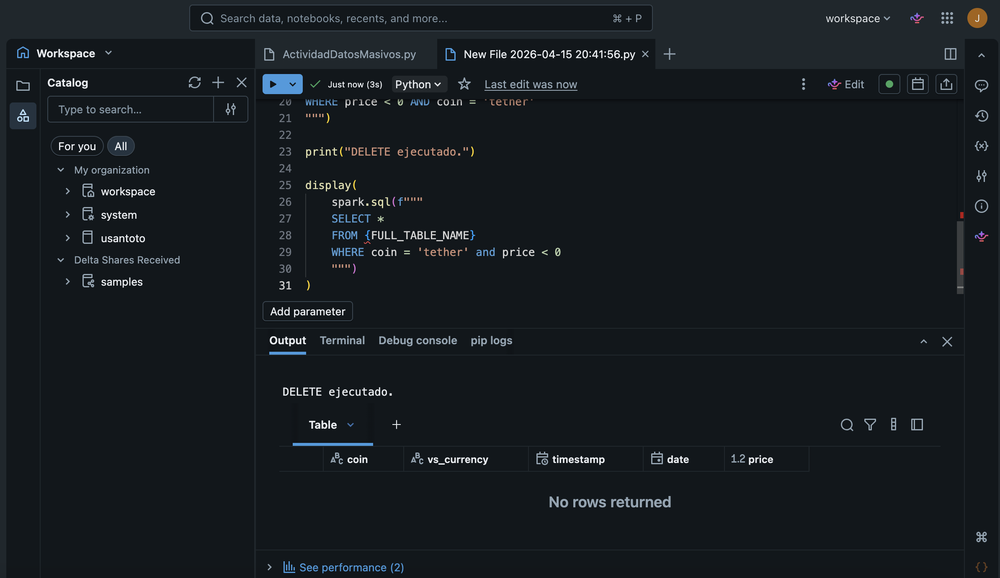
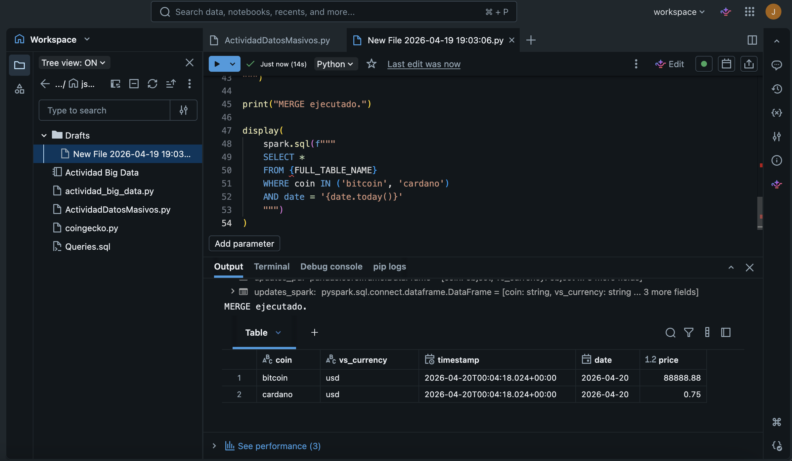
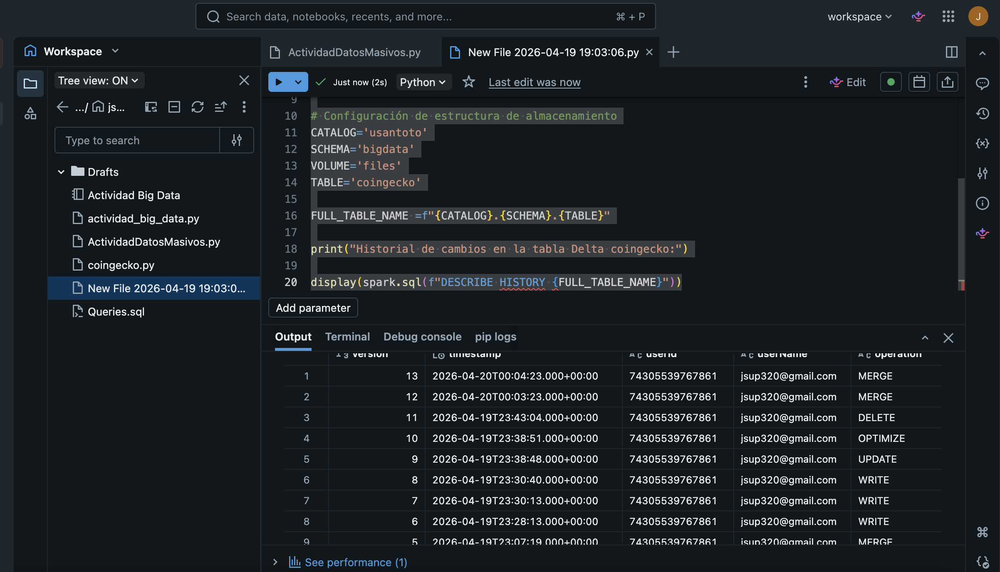

# 1. Documentacion de CoinGecko 
### link: https://www.coingecko.com/en/api/documentation 

CoinGecko es una plataforma de análisis de criptomonedas que proporciona datos en tiempo real sobre precios, volumen de operaciones, capitalización de mercado y otros indicadores clave para una amplia gama de criptomonedas. La plataforma ofrece una API que permite a los desarrolladores acceder a estos datos de manera programática.

# 2. Script en Python databricks

actividad_datos_masivos.py
```python
import requests
import time
import json
from datetime import datetime, date, UTC
import pandas as pd
 
from pyspark.sql import functions as F
from pyspark.sql import Row

# Configuración de estructura de almacenamiento
CATALOG='usantoto'
SCHEMA='bigdata'
VOLUME='files'
TABLE='coingecko'

FULL_TABLE_NAME =f"{CATALOG}.{SCHEMA}.{TABLE}"

# parametros de consulta a la API
COINS = ['bitcoin', 'ethereum', 'solana', 'tether']
VS_CURRENCY = 'usd'
DAYS = 30
 
# Timestamp UTC con zona horaria
RUN_TS = datetime.now(UTC)
 
# String segura para rutas
RUN_DATE = RUN_TS.strftime('%Y-%m-%d')
 
spark.sql(f"CREATE SCHEMA IF NOT EXISTS {CATALOG}.{SCHEMA}")
spark.sql(f"CREATE VOLUME IF NOT EXISTS {CATALOG}.{SCHEMA}.{VOLUME}")

RAW_BASE_PATH = f"/Volumes/{CATALOG}/{SCHEMA}/{VOLUME}/lab2/raw/{RUN_DATE}"
PROCESSED_BASE_PATH = f"/Volumes/{CATALOG}/{SCHEMA}/{VOLUME}/lab2/processed/{RUN_DATE}"
 
CSV_OUTPUT_PATH = f"{PROCESSED_BASE_PATH}/csv"
PARQUET_OUTPUT_PATH = f"{PROCESSED_BASE_PATH}/parquet"
 
 
print('Tabla destino:', FULL_TABLE_NAME)
print('Fecha de ejecución:', RUN_DATE)
print('RAW_BASE_PATH:', RAW_BASE_PATH)
print('PROCESSED_BASE_PATH:', PROCESSED_BASE_PATH)
print(f"Esquema listo: {CATALOG}.{SCHEMA}")
print(f"Volumen listo: {CATALOG}.{SCHEMA}.{VOLUME}")

#API KEY 
API_KEY = "CG-uTR7uMUrrB51vxvuCtJMx6Ah"

def fetch_market_chart(
    coin: str,
    vs_currency: str = "usd",
    days: int = 30,
    max_retries: int = 4
) -> dict:
    """Consulta precios históricos desde CoinGecko con reintentos básicos."""
    url = f"https://api.coingecko.com/api/v3/coins/{coin}/market_chart"
    headers = {
    "accept": "application/json",
    "x_cg_demo_api_key": API_KEY
    }
    params = {
        "vs_currency": vs_currency,
        "days": days
    }
 
    response = None
 
    for attempt in range(max_retries):
        response = requests.get(url,params=params, headers=headers, timeout=30)
 
        if response.status_code == 200:
            return response.json()
 
        if response.status_code in (429, 500, 502, 503, 504):
            wait_time = 2 * (attempt + 1)
            print(f"Reintento {attempt + 1}/{max_retries} para {coin}. Esperando {wait_time}s...")
            time.sleep(wait_time)
        else:
            response.raise_for_status()
 
    response.raise_for_status()

all_processed = []

for coin in COINS:
    print(f"Consultando datos para: {coin}")
    data = fetch_market_chart(coin=coin, vs_currency=VS_CURRENCY, days=DAYS)
 
    raw_path = f"{RAW_BASE_PATH}/{coin}.json"
    dbutils.fs.put(raw_path, json.dumps(data), overwrite=True)
    print(f"RAW guardado en: {raw_path}")
 
    prices = data.get("prices", [])
 
    if not prices:
        print(f"No se encontraron precios para {coin}")
        continue
 
    pdf = pd.DataFrame(prices, columns=["timestamp_ms", "price"])
    pdf["timestamp"] = pd.to_datetime(pdf["timestamp_ms"], unit="ms", utc=True)
    pdf["date"] = pdf["timestamp"].dt.date
    pdf["coin"] = coin
    pdf["vs_currency"] = VS_CURRENCY
 
    pdf = pdf[["coin", "vs_currency", "timestamp", "date", "price"]]
    all_processed.append(pdf)
 
print("Extracción completada.")

print("Archivos RAW generados:")
display(dbutils.fs.ls(RAW_BASE_PATH))

df_pd = pd.concat(all_processed, ignore_index=True)
df_pd.head()

df_spark = spark.createDataFrame(df_pd)
 
df_spark = (
    df_spark
    .withColumn("timestamp", F.col("timestamp").cast("timestamp"))
    .withColumn("date", F.col("date").cast("date"))
    .withColumn("price", F.col("price").cast("double"))
)

df_spark.printSchema()
print(f"Total de registros: {df_spark.count()}")
print(f"Total de monedas: {df_spark.select('coin').distinct().count()}")

(
    df_spark.coalesce(1)
    .write
    .mode("overwrite")
    .option("header", True)
    .csv(CSV_OUTPUT_PATH)
)
 
print(f"CSV guardado en: {CSV_OUTPUT_PATH}")

(
    df_spark.write
    .mode("overwrite")
    .parquet(PARQUET_OUTPUT_PATH)
)
 
print(f"Parquet guardado en: {PARQUET_OUTPUT_PATH}")
 
print("Contenido de processed:")
display(dbutils.fs.ls(PROCESSED_BASE_PATH))
 
df_csv = (
    spark.read
    .option("header", True)
    .option("inferSchema", True)
    .csv(CSV_OUTPUT_PATH)
)
 
df_parquet = spark.read.parquet(PARQUET_OUTPUT_PATH)
 
print("Registros en CSV:", df_csv.count())
print("Registros en Parquet:", df_parquet.count())
 
print("Esquema CSV")
df_csv.printSchema()
 
print("Esquema Parquet")
df_parquet.printSchema()

```
Recuperacion de la información en formato JSON desde la API.



Conversion y almacenamiento de los datos procesados en diferentes formatos



# 3. Tabla Delta en Databricks 


```python
spark.sql(f"DROP TABLE IF EXISTS {FULL_TABLE_NAME}")
 
(
    df_spark.write
    .format("delta")
    .mode("overwrite")
    .saveAsTable(FULL_TABLE_NAME)
)
 
print(f"Tabla Delta creada: {FULL_TABLE_NAME}")
 
def get_directory_size_bytes(path: str) -> int:
    """Suma recursivamente el tamaño de todos los archivos dentro de una ruta."""
    total_size = 0
 
    for item in dbutils.fs.ls(path):
        if item.isDir():
            total_size += get_directory_size_bytes(item.path)
        else:
            total_size += item.size
 
    return total_size
 
 
def bytes_to_human_readable(num_bytes: int) -> str:
    """Convierte bytes a una unidad legible."""
    units = ["B", "KB", "MB", "GB", "TB"]
    size = float(num_bytes)
 
    for unit in units:
        if size < 1024 or unit == units[-1]:
            return f"{size:.2f} {unit}"
        size /= 1024
 
 
json_size = get_directory_size_bytes(RAW_BASE_PATH)
csv_size = get_directory_size_bytes(CSV_OUTPUT_PATH)
parquet_size = get_directory_size_bytes(PARQUET_OUTPUT_PATH)
DELTA_COMPARE_PATH = f"{PROCESSED_BASE_PATH}/delta_compare"
(
    df_spark.write
    .format("delta")
    .mode("overwrite")
    .save(DELTA_COMPARE_PATH)
)
delta_size = get_directory_size_bytes(DELTA_COMPARE_PATH)
 
print("Tamaño Delta:", bytes_to_human_readable(delta_size))
print("Tamaño JSON RAW:", bytes_to_human_readable(json_size))
print("Tamaño CSV:", bytes_to_human_readable(csv_size))
print("Tamaño Parquet:", bytes_to_human_readable(parquet_size))

print("Historial inicial de la tabla Delta:")
display(spark.sql(f"DESCRIBE HISTORY {FULL_TABLE_NAME}"))
 
```
# 3. Operaciones de manipulación de datos en Delta Lake

## Insercion y consulta de nuevos registros


```python 

FULL_TABLE_NAME =f"{CATALOG}.{SCHEMA}.{TABLE}"

new_rows = [
    Row(
        coin="tether",
        vs_currency="usd",
        timestamp=datetime.now(UTC),
        date=date.today(),
        price=1599.99
    ),
    Row(
        coin="tether",
        vs_currency="usd",
        timestamp=datetime.now(UTC),
        date=date.today(),
        price=99.99
    )
]
 
new_df = spark.createDataFrame(new_rows)
 
(
    new_df.write
    .format("delta")
    .mode("append")
    .saveAsTable(FULL_TABLE_NAME)
)
 
print("Nuevos registros insertados.")
 
display(
    spark.sql(f"""
    SELECT *
    FROM {FULL_TABLE_NAME}
    WHERE coin = 'tether' and date = '{date.today()}'
    ORDER BY timestamp DESC
    LIMIT 5
    """)
) 

``` 
# 4. Actualización de registros


``` python 
 
# UPDATE
 
spark.sql(f"""
UPDATE {FULL_TABLE_NAME}
SET price = price * 1.01
WHERE coin = 'tether' AND price = 99.99
""")

print("UPDATE ejecutado sobre registros de solana.")

display(
    spark.sql(f"""
    SELECT *
    FROM {FULL_TABLE_NAME}
    WHERE coin = 'tether' and date = '{date.today()}'
    ORDER BY timestamp DESC
    LIMIT 5
    """)
) 
 

```

# 5. Eliminación de registros 


``` python
 
spark.sql(f"""
DELETE FROM {FULL_TABLE_NAME}
WHERE price < 0 AND coin = 'tether' 
""")

print("DELETE ejecutado.")

display(
    spark.sql(f"""
    SELECT *
    FROM {FULL_TABLE_NAME}
    WHERE coin = 'tether' and price < 0
    """)
)
 
 ``` 

# 6. merge de registros (upsert) 


``` python
 
updates_data = [
    ("bitcoin", "usd", datetime.now(UTC), date.today(), 88888.88),
    ("cardano", "usd", datetime.now(UTC), date.today(), 0.75)
]
 
updates_pd = pd.DataFrame(
    updates_data,
    columns=["coin", "vs_currency", "timestamp", "date", "price"]
)
 
updates_spark = spark.createDataFrame(updates_pd)
updates_spark.createOrReplaceTempView("coin_updates")
 
spark.sql(f"""
MERGE INTO {FULL_TABLE_NAME} AS target
USING coin_updates AS source
ON target.coin = source.coin AND target.date = source.date
WHEN MATCHED THEN
  UPDATE SET
    target.vs_currency = source.vs_currency,
    target.timestamp = source.timestamp,
    target.price = source.price
WHEN NOT MATCHED THEN
  INSERT (coin, vs_currency, timestamp, date, price)
  VALUES (source.coin, source.vs_currency, source.timestamp, source.date, source.price)
""")
 
print("MERGE ejecutado.")

display(
    spark.sql(f"""
    SELECT *
    FROM {FULL_TABLE_NAME}
    WHERE coin IN ('bitcoin', 'cardano') 
    AND date = '{date.today()}'
    """)
)
```
8. consulta de historial de cambios en la tabla Delta

``` python

print("Historial de cambios en la tabla Delta:")

display(spark.sql(f"DESCRIBE HISTORY {FULL_TABLE_NAME}"))
```
# Aplicacion de perspectiva conceptual y técnica del ejercicio. 

## Datos estructurados y semi-estructurados en Delta Lake

En el flujo del proceso de extracción se presentan los datos en formato JSON obtenidos desde la fuente de información API este tipo de información, tiene  formato semi-estructurado. Cuando se procesan estos datos, se convierten en un formato estructurado (DataFrame) para su almacenamiento y análisis en Delta Lake. Esto permite aprovechar las capacidades de consulta y manipulación de datos estructurados, al mismo tiempo que se mantiene la flexibilidad de trabajar con datos semi-estructurados en su forma original cuando sea necesario.

## Diferencias entre JSON, CSV, Parquet y Delta Lake

| Formato     | Tipo de Datos       | Ventajas                                      | Desventajas                                  |
|-------------|---------------------|-----------------------------------------------|----------------------------------------------|
| JSON        | Semi-estructurado   | Flexible, formato fácil de leer, ampliamente soportado | No es eficiente para grandes volúmenes de datos, dentro de su estructura no es columnar  |
| CSV         | Estructurado        | Tipo de archivo simple, fácil de usar, ampliamente soportado  | No soporta tipos de datos complejos, no es eficiente para grandes volúmenes de datos |
| Parquet      | Estructurado        | Columnar, eficiente para la lectura de grandes volúmenes de datos, soporta tipos de datos complejos | No es tan fácil de leer como JSON o CSV, requiere herramientas específicas para su manejo |
| Delta Lake   | Estructurado        | Soporta transacciones ACID, transacciones, versionado, eficiente para grandes volúmenes de datos|Requiere un entorno compatible como Databricks, puede ser más complejo de configurar y administrar que otros formatos. |        
 

# Escenarios en los que convendría usar cada formato dentro de un flujo de Big Data 
| Formato     | Escenario de Uso                                                                 |
|-------------|----------------------------------------------------------------------------------|
| JSON        | Ideal para datos semi-estructurados, como logs o eventos dentro procesos de ETL. es muy útil para la obtención  de datos desde APIs o sistemas que generan datos en formato JSON |
| CSV         | Adecuado para datos tabulares simples, como hojas de cálculo, exportaciones de bases de datos o datos que no requieren tipos de datos complejos. Es clave su uso en la transferencia de datos entre sistemas. |
| Parquet      | Su uso es recomendado para el almacenamiento y análisis de grandes volúmenes de datos estructurados, especialmente en entornos de Big Data. Es eficiente para consultas analíticas y es compatible con herramientas como Apache Spark, Hive y Presto. |
| Delta    | Ideal para casos donde se requiere soporte para transacciones ACID, versionado de datos y operaciones de manipulación de datos (inserciones, actualizaciones, eliminaciones). Es especialmente útil en entornos de Big Data donde la consistencia y la integridad de los datos son críticas, como en pipelines de datos complejos, análisis en tiempo real o escenarios de machine learning donde los datos pueden cambiar con el tiempo. |      

# Reflexion 

##  diferencias entre los datos semiestructurados y los estructurados

Los datos semiestructurados, como el formato JSON, no siguen un esquemas rígidos y pueden contener una variedad de tipos de datos y estructuras anidadas. Esto los hace flexibles y fáciles de usar para representar datos complejos o jerárquicos. Por otro lado, los datos estructurados, como los almacenados en formatos como SQL, CSV o Parquet, siguen un esquema definido con columnas y tipos de datos específicos. lo que beneficia en su análisis y manipulación utilizando herramientas de bases de datos tradicionales o sistemas de procesamiento de datos como Apache Spark.

## formato consideras más adecuado para el análisis de datos 

El formato Parquet se puede convertir en una de las opciones  el más adecuadas para el análisis de datos, debido a su eficiencia en la lectura y almacenamiento de grandes volúmenes de datos estructurados. Parquet es un formato columnar que permite una compresión eficiente y un acceso rápido a los datos, lo que lo hace ideal para consultas analíticas y procesamiento de datos en entornos de Big Data. Además, es compatible con herramientas como Apache Spark, lo que facilita su integración en pipelines de datos y análisis avanzados.

# ventajas de Delta Lake frente a otros formatos de almacenamiento
Delta Lake ofrece varias ventajas frente a otros formatos de almacenamiento, como JSON, CSV o Parquet. Una de las principales ventajas es su soporte para transacciones ACID, lo que garantiza la consistencia y la integridad de los datos incluso en entornos de Big Data donde múltiples procesos pueden acceder y modificar los datos simultáneamente. Además, Delta Lake proporciona versionado de datos, lo que permite verificar cambios a lo largo del tiempo y revertir a versiones anteriores si es necesario. También ofrece un rendimiento mejorado para operaciones de lectura y escritura, especialmente en escenarios de análisis en tiempo real o pipelines de datos complejos..

# importancia las propiedades ACID en un entorno moderno de datos
 ACID (Atomicidad, Consistencia, Aislamiento y Durabilidad) es fundamental en un entorno moderno de datos ya que garantizan la integridad y la confiabilidad de los datos en sistemas de bases de datos y almacenamiento. 

 La Atomicidad asegura que las operaciones se completen completamente o no se realicen en absoluto, evitando estados intermedios inconsistentes. La consistencia garantiza que los datos siempre estén en un estado válido.

 El Aislamiento asegura que las transacciones concurrentes no interfieran entre sí, manteniendo la integridad de los datos. 

 La Consistencia garantiza que las transacciones solo puedan llevar a la base de datos de un estado válido a otro estado válido, manteniendo la integridad de los datos.

 La Durabilidad garantiza que una vez que una transacción se ha confirmado, sus cambios persistirán incluso en caso de fallos del sistema. Estas propiedades son esenciales para mantener la confianza en los datos y asegurar que las aplicaciones y análisis basados en esos datos sean precisos y confiables.

 